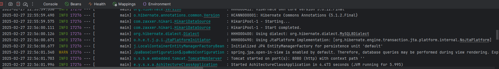

#### 安装教程

1.  创建一个空目录，用git克隆项目到该目录下
2.  打开IDEA
3.  打开克隆的项目
4.  点击Trust Project
5.  点击File->Project Structure->Project settings->project->SDK->选择SDK为11
6.  点击侧边Maven按钮->点击Sync All Maven Projects->等待Maven自动同步下载依赖
7.  确认下载完成后，右键pom.xml 执行Reload Project
8.  运行AchitectureClassApplication，后端系统会自动启动
9.  点击运行之后，如果需要，可在localhost:8080/doc.html能打开接口调试界面
10. 测试用户名：root，密码：admin，usertoken（即本系统jwt签发的token）默认有效期24小时

#### 使用说明
1.  项目使用MySQL+Maven+Springboot架构
2.  common包里有每层的基础类
3.  各层的具体实体在各层的文件夹内，均继承于该类的基础类
4.  用户登陆时，使用jwt，若数据库验证正确，会使用密钥签发token，若token过期或者token无法解析(即所给token不是该密钥签发的token)，则认为登陆无效
5.  批次信息，传感器信息（包括传感器数据），摄影机信息均存储于数据库中，由于后台服务器频繁获取token会屏蔽ip，且该交互方式不适合使用观察者模式，则在后端同一10秒一次同一刷新数据，计算参数并存入数据库中，前端向后端数据库读取数据
6.  本项目假设每个大棚只有一个摄影机
7.  传感器访问token和摄影机token均存放在数据库内，若需要token而上一次的token还未过期，则直接使用数据库的数据而不是重新获取，若已过期则重新获取。
8.  每种传感器的数据均拟了一个最大值存储在数据库中，以后可以根据需要修改该值。当实际数据<最大值*0.3时为低状态，均标记蓝色。当最大值*0.3<=实际数据<=最大值*0.7时，为良状态，土质数据标记darkcyan色，环境数据标记绿色。当实际数据>最大值*0.7时，为高状态，均标记红色
9.  各种token解析：usertoken是本系统在用户登陆时使用本系统的密钥签发给用户的token。accesstoken是从传感器的服务器上获得，访问各传感器使用的token。videotoken是从萤石平台上获得，访问视频直播和拍照使用的token
10. 运行效果：

- 「株式会社　腾梁技研」 does not exist.
- 「A Group Led By Zhuohong Cun」 © All Rights Reserved

